# [Printify](https://printify-five.vercel.app/) &middot; [](https://www.linkedin.com/in/sanskar-gupta-12476423b/)  
[](https://github.com/Sanskargupta0/Printify)  
[](https://react.dev/)  
[](https://vitejs.dev/)  
[](https://tailwindcss.com/)

## 📝 Project Description

Printify is a dynamic, React-based web application designed to streamline product management and quotation generation. It features customizable product listings, email integration for quotation requests, and enhanced interactivity with animations and responsive UI components. Users can search products, view similar suggestions, and download personalized quotations as PDFs. The platform is built with modern tools like Vite, Tailwind CSS, and React Router, ensuring a smooth and scalable experience.


## ⚙️ Tech Stack

- React (via Vite)
- Tailwind CSS
- AOS (Animation On Scroll)
- HTML2PDF.js
- React Router Dom
- React Icons
- React Slick Carousel
- React Toastify
- Styled Components

## 🔋 Features

👉 **Dynamic Product Listing & Navigation**: Dynamically render product listings, navigation links, and footer links through a constants file which is in [Constant-File](./src//constants//products.js).

👉 **Email Integration with [SendMail API](https://github.com/Sanskargupta0/Email-Send-API.git)**: Enables dynamic email sending, including quotations and contact form submissions.

👉 **Catalogue Download**: This will download the PDF file of Catalogue 
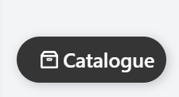

👉 **Interactive UI Components**: Customizable UI elements, such as forms, buttons, and carousels, with a responsive design and enhanced user experience.

👉 **PDF Download Functionality**: Download customized pages as PDFs using HTML2PDF.js for reports or printable documents of Quotation.

👉 **Toast Notifications**: User notifications using React Toastify for instant feedback and alerts.

👉 **Animations**: Enhanced animations using AOS (Animation on Scroll) library for a more engaging user experience.

👉 **State Management and Routing**: Easy navigation and state management using React Router Dom.

## 🔍 Search Functionality, Similar Product Suggestions, and Quotation PDF Download

### Features:

- **Search for Products**: Users can search for products by name using the search bar.
- **Similar Product Suggestions**: When a user types in or selects a product, similar products are suggested.
- **Quotation PDF Download**: Users can download a quotation PDF for the selected product(s).
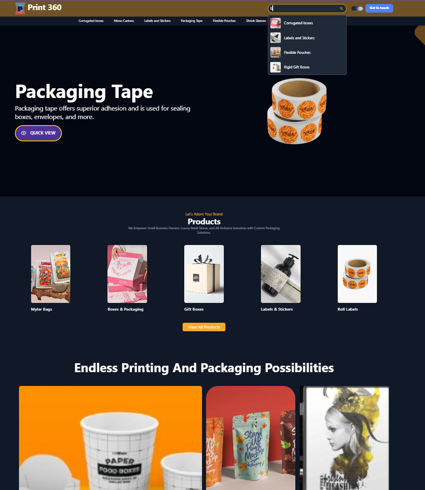

## Demo

Check out the live demo of the project [here](https://printify-five.vercel.app/).

## 🤸 Quick Start

Follow these steps to set up the project locally on your machine.

### Prerequisites

Make sure you have the following installed:

- [Git](https://git-scm.com/)
- [Node.js](https://nodejs.org/en) (with npm)

### Cloning the Repository

```bash
git clone https://github.com/Sanskargupta0/Printify.git
cd Printify

### Insallation

Instaall dependencies using npm:

```bash
npm install
```

#### Running the Project 

```bash
npm run dev
```

opens the project in your default browser at `http://localhost:3000`.

## Integration with SendMail API

This project uses the [SendMail API](https://github.com/Sanskargupta0/Email-Send-API.git) for sending dynamic emails. Below are some examples of email features provided by this API:

### Features

- Send dynamic emails with attachments.
- Configurable email templates (quotations, contact forms, etc.).
- Built with Node.js and Express.

### Setup and Usage

1. Clone and setup the SendMail API from [here](https://github.com/Sanskargupta0/Email-Send-API.git).
2. Configure environment variables as described in the API documentation.
3. Integrate API endpoints within your project for dynamic email functionalities.

### Screenshots

#### Landing Page

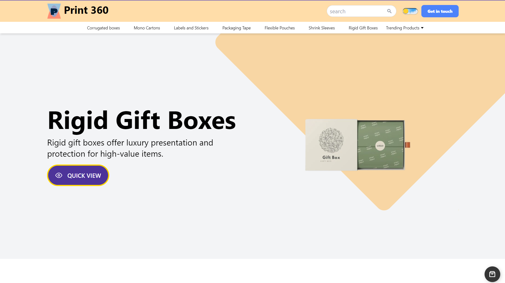
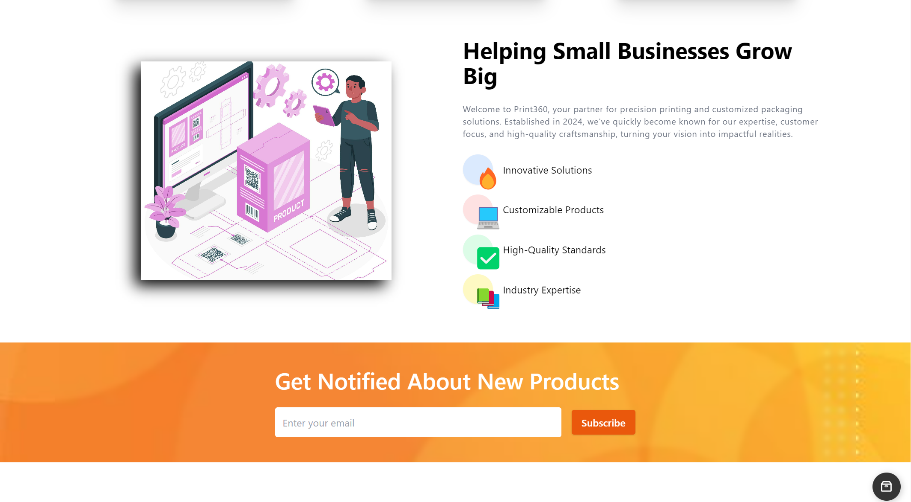

#### Product Listing Page

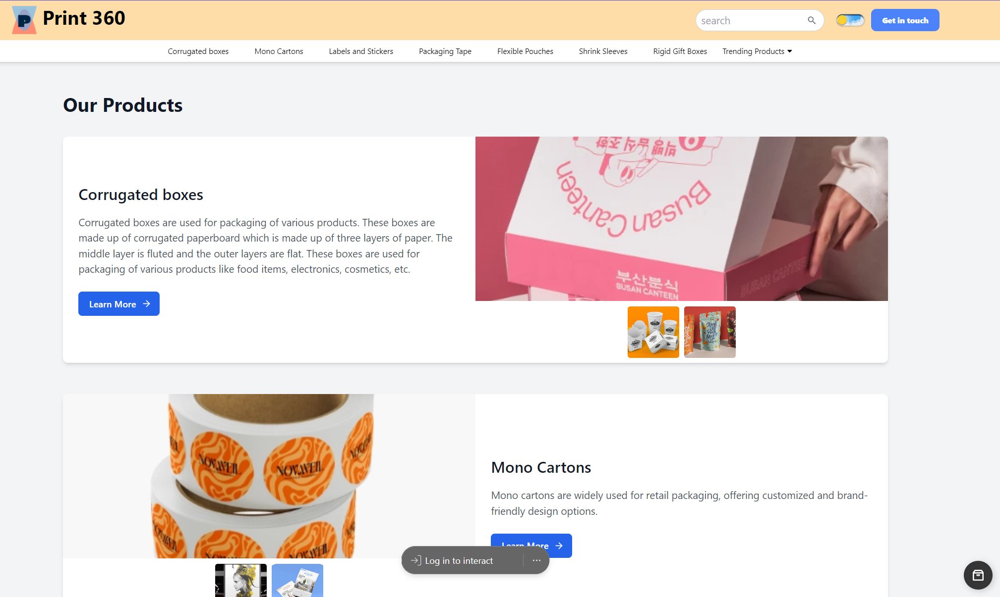
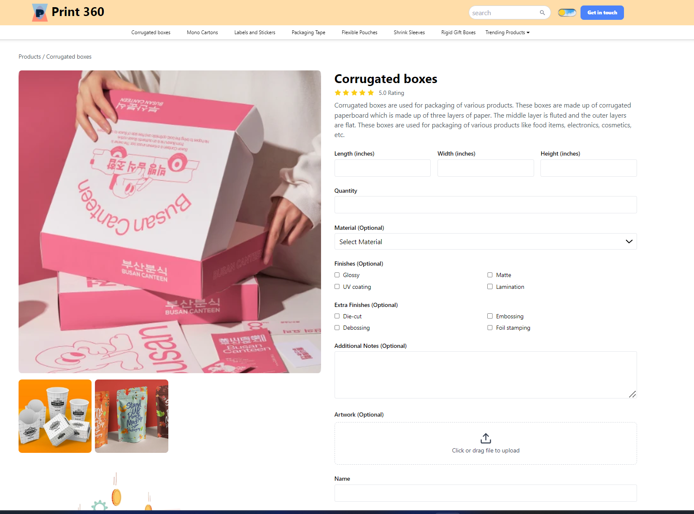

### Also like Products

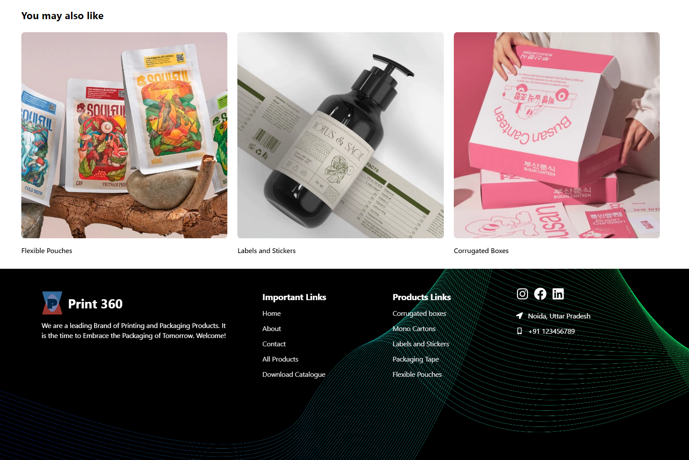

#### Contact Form

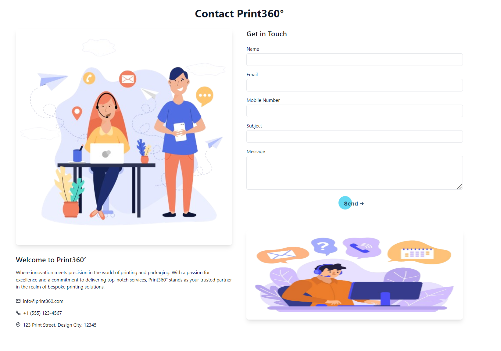

#### About Us Page

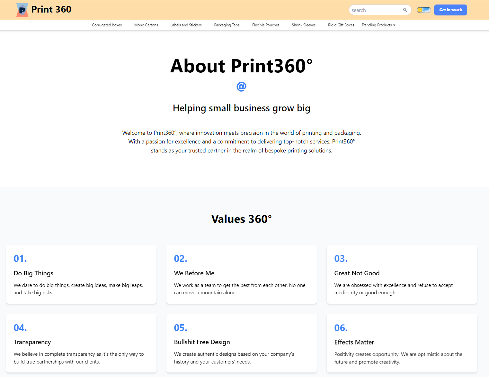

#### Error 404 Page

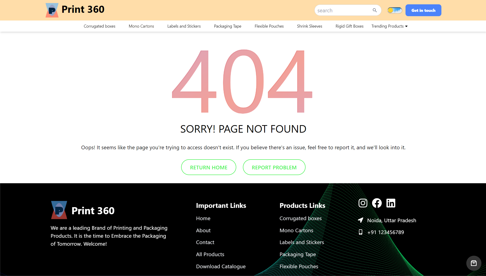

#### Quataion PDF Download

Open the [Print360-Quotation-Corrugated boxes-2024-11-18.pdf](./Screenshots//Print360-Quotation-Corrugated%20boxes-2024-11-18.pdf)

#### Quotation Email Example

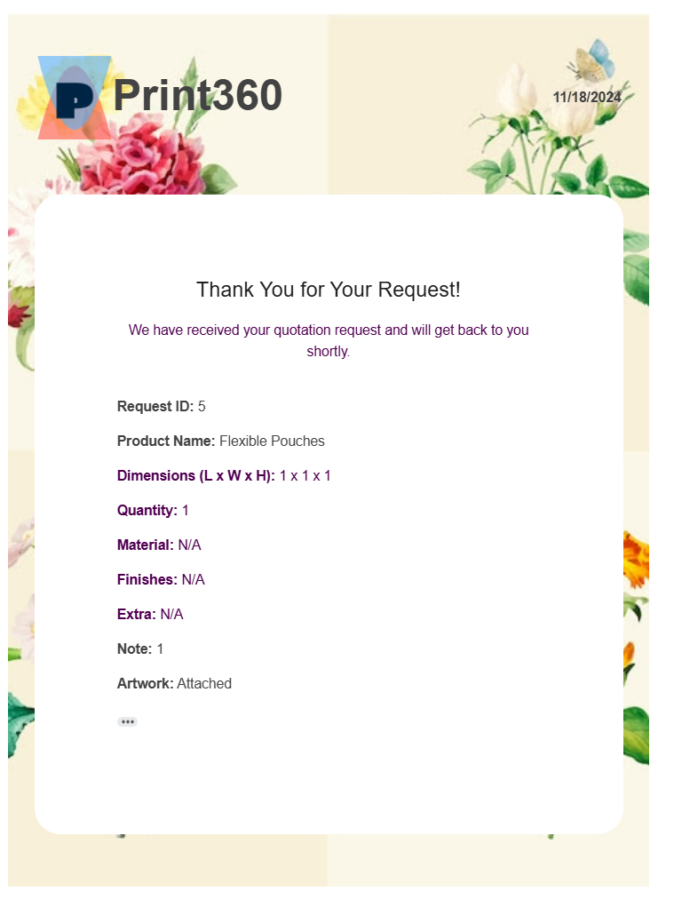


